# Project 1: Lamp stack implementation

### Firstly, I connected my Ec2 instance and remote into the terminal. After that, I took the following steps to get this project 1 done.
## Step 1- Installing apache and updating the firewall
1. I ran `sudo apt update` to update a list of packages in package manager and below is the output.
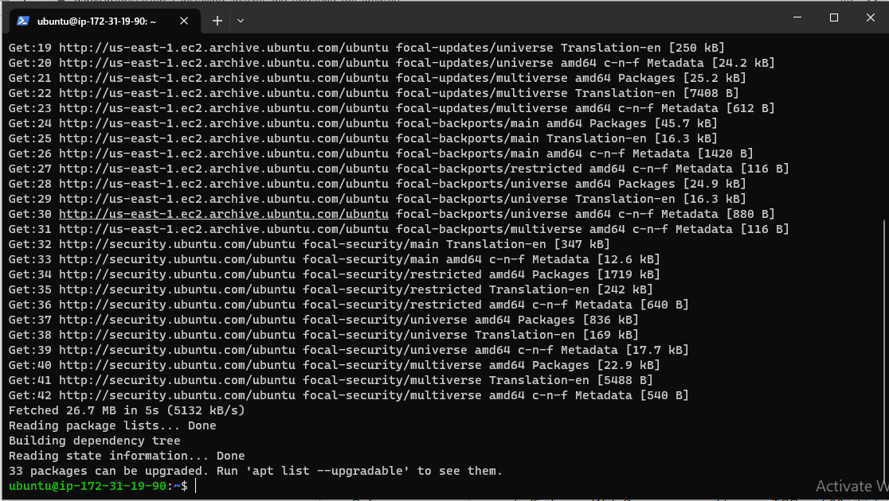

2. I ran `sudo apt install apache2` to run apache2 package installation and beow is the output.
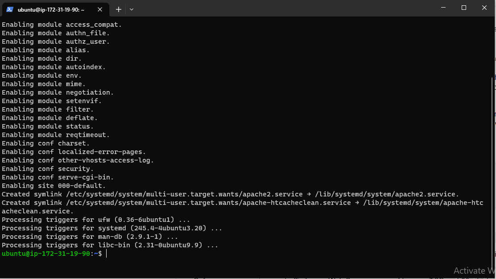

3. To verify that apache2 is running as a Service in my OS I used the following command `sudo systemctl status apache2` and below is the output.
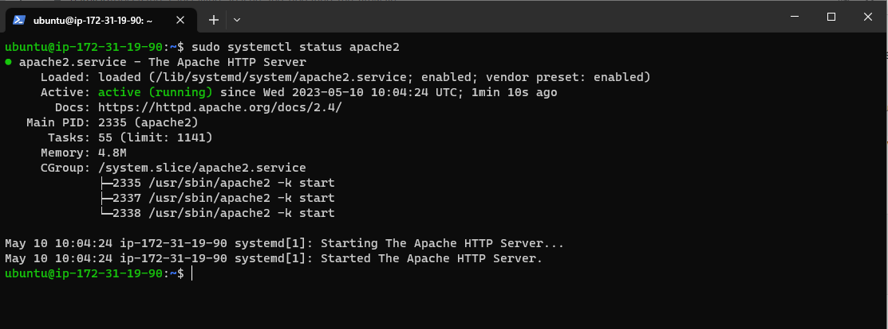

4. I went to Aws to add a rule to EC2 configuration to open inbound connection through port 80 since the one i have is port 22 which comes by default to be able to receive any traffic by my Web Server. After that, I ran ` curl http://54.242.61.43/:80` to access it locally in my Ubuntu shell and below is the output.
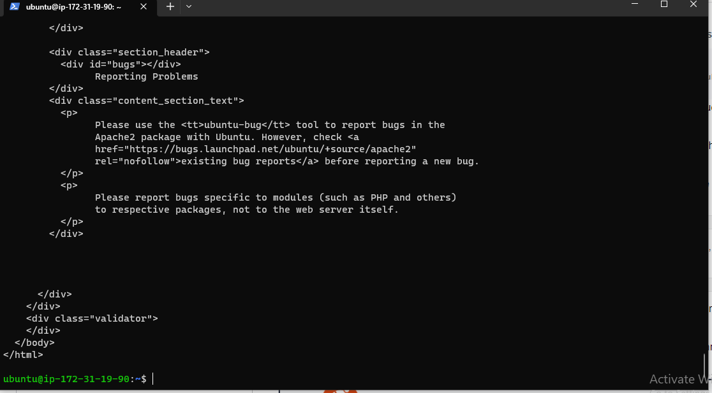

I also ran `http://54.242.61.43:80` to access it on my internet browser and got the oputput below.
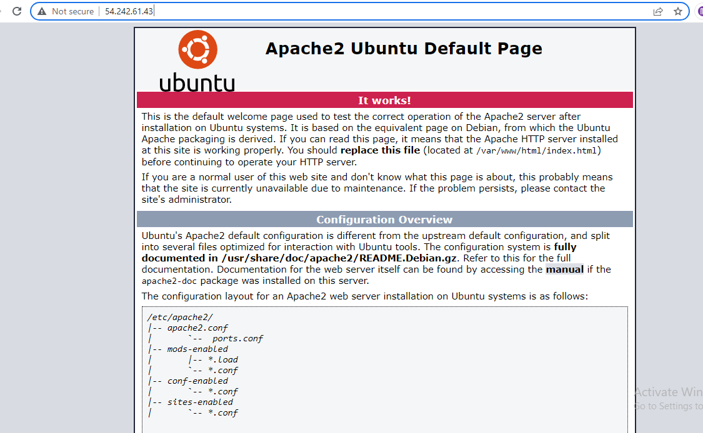

## Step 2- Installing MYSQL
1. I ran `sudo apt install mysql-server` to to acquire and install this software and got the output below.
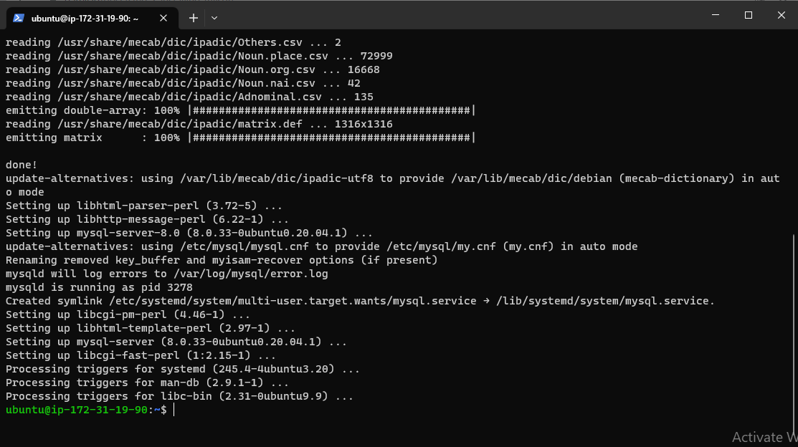

2. I ran `sudo mysql` to log in to the MySQL console and below is the output.
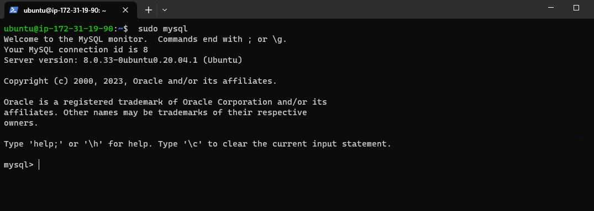

3. I ran `ALTER USER 'root'@'localhost' IDENTIFIED WITH mysql_native_password BY 'PassWord.1';` to set a password for the root user, using mysql_native_password as default authentication method and got the output below.
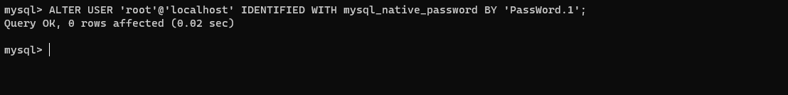

After that, I ran `exit` to exit the MySQL shell and below is th output.
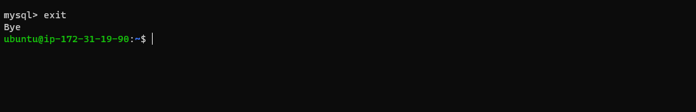

4. I also ran `sudo mysql_secure_installation` a security script that comes pre-installed with MySQL to remove some insecure default settings and lock down access to my database system and below are the output (the top and end part). Note: I answered no, no, yes, no, no, yes respectively on the prompts. 
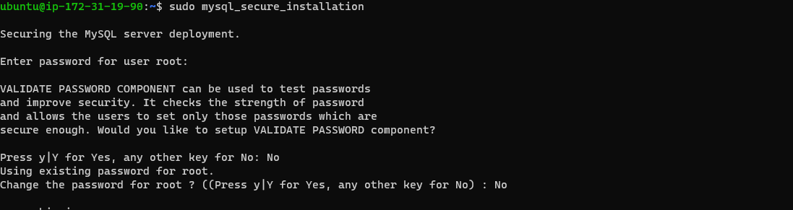
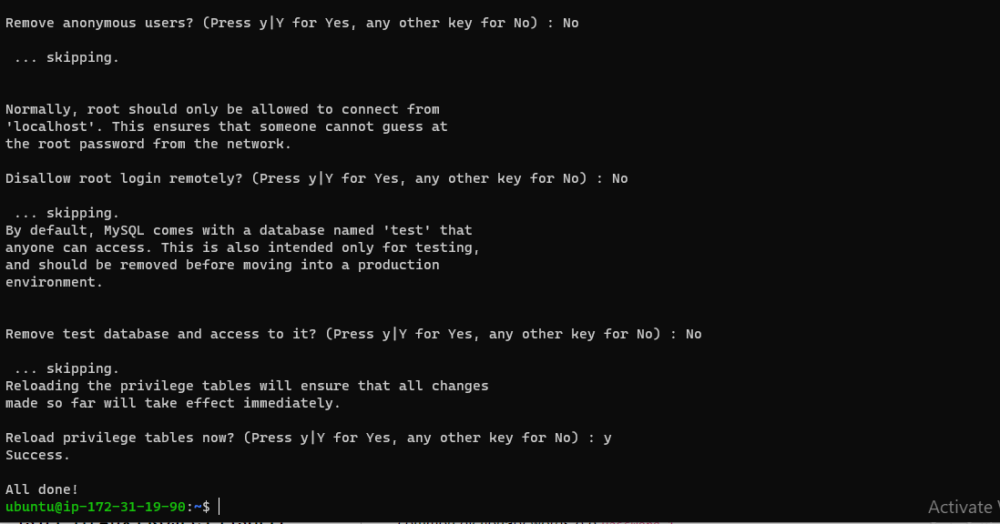

5. I ran `sudo mysql -p` to test if i am able to log in to the MySQL console and below is the output.
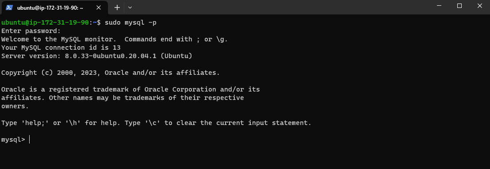

Then, exit MYSQL console, the output is below.
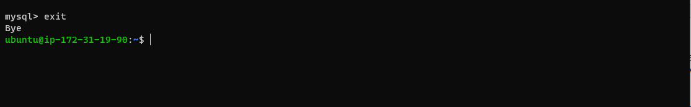

## Step 3- Installing PHP
1. I ran `sudo apt install php libapache2-mod-php php-mysql` to install PHP packages and below is the output.
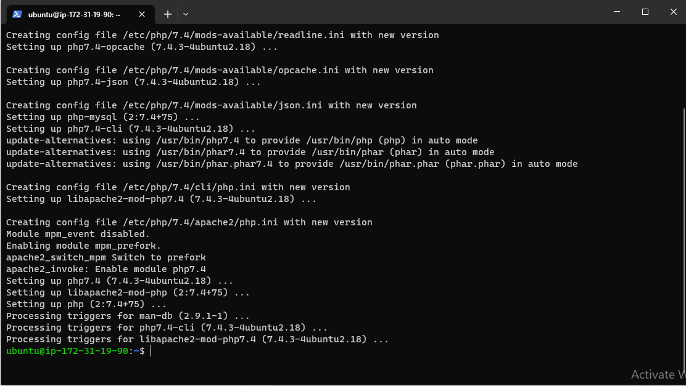

2. I ran `php -v` to confirm my PHP version and below is the output.
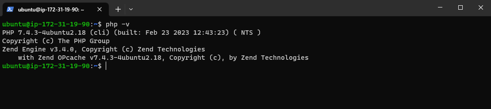

## Step 4- Creating a virtual host for website using apache
1. I ran `sudo mkdir /var/www/projectlamp` to Create the directory for projectlamp, ` sudo chown -R $USER:$USER /var/www/projectlamp`  to assign ownership of the directory with my current system user and below are the outputs.
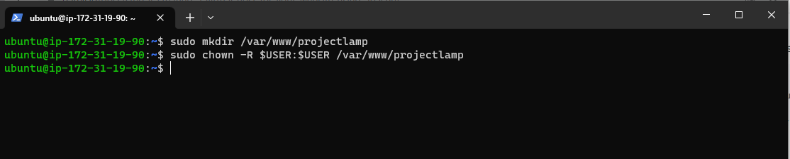

2. I created and opened a new configuration file in Apache’s sites-available directory using a vi editor. so, I ran `sudo vi /etc/apache2/sites-available/projectlamp.conf` and hit i to be able to edit then, pasted in my bare-bones configuration, hit esc botton then, type :wq and hit ente to save the file. And below are my outputs respectively.
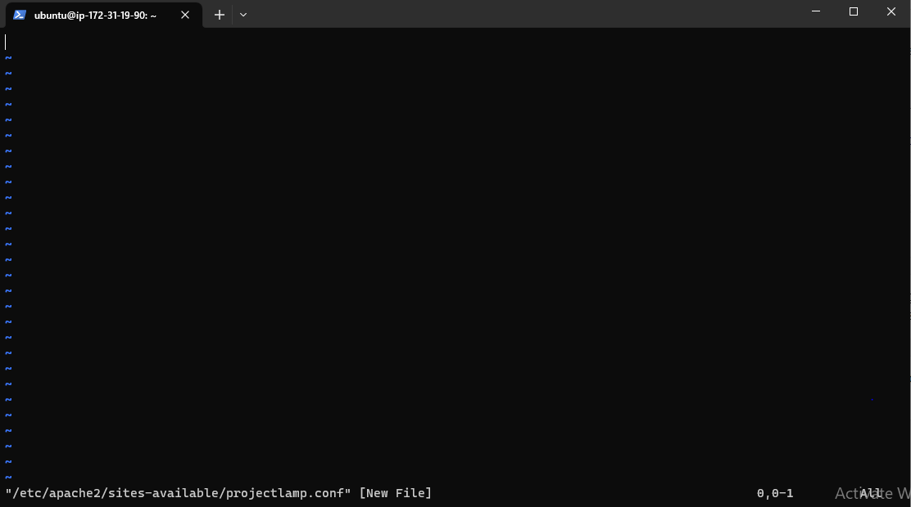
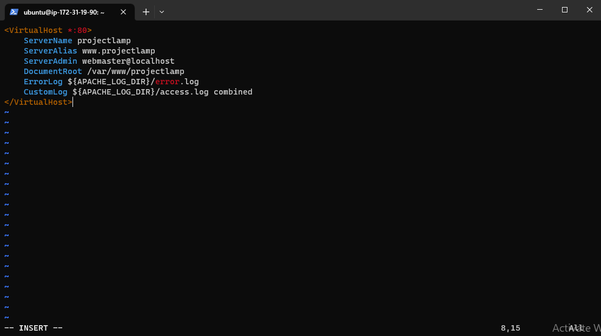

3. I ran `sudo ls /etc/apache2/sites-available` to  show the new file in the sites-available directory and below is the output.
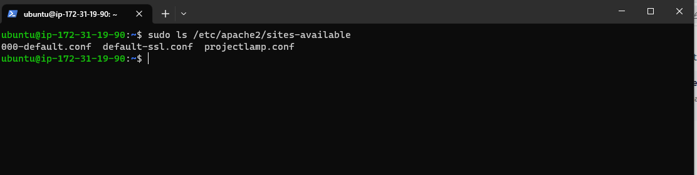

4. I ran `sudo a2ensite projectlamp` to enable the new virtual host and `sudo a2dissite 000-default` to  disable the default website that comes installed with Apache and below are the outputs respectively.
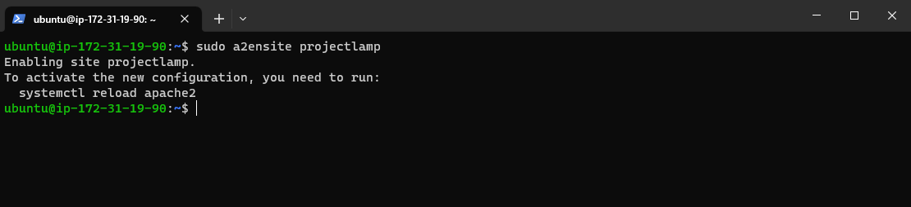 
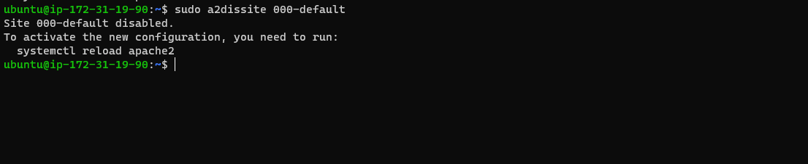

5. I ran `sudo apache2ctl configtest` to make sure your configuration file doesn’t contain syntax errors and `sudo systemctl reload apache2` to reload Apache so these changes take effect below is the output.
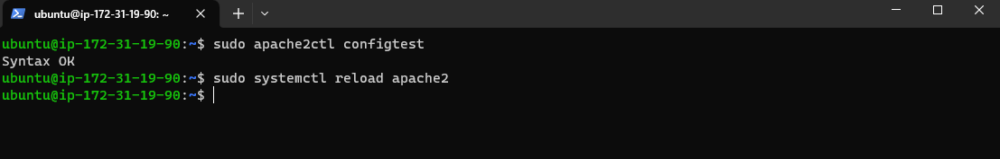

6. I created an hmtl file `sudo echo 'Hello LAMP from hostname' $(curl -s http://169.254.169.254/latest/meta-data/public-hostname) 'with public IP' $(curl -s http://169.254.169.254/latest/meta-data/public-ipv4) > /var/www/projectlamp/index.html` to test that the virtual host works as expected and below is the output.
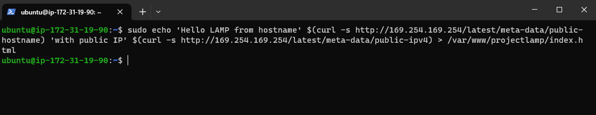

7. Ran `http://http://54.242.61.43/:80` to open my website URL using IP address and `http://ec2-54-242-61-43.compute-1.amazonaws.com:80` to open my website using DNS name and below are the outputs respectively.
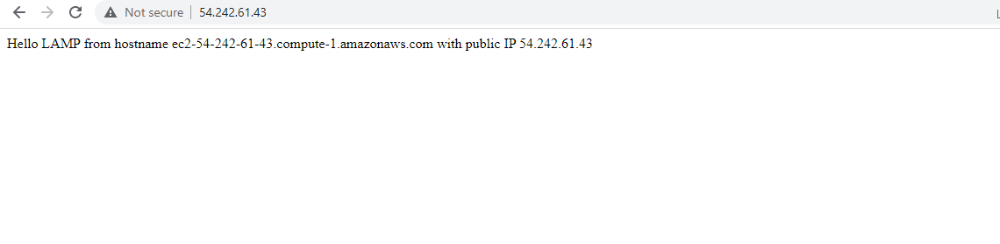
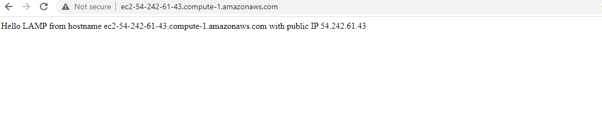

## Step 5- Enable PHP on the website
Note that when the default DirectoryIndex settings on Apache, a file named index.html will always take precedence over an index. php file. This is useful for setting up maintenance pages inPHP applications, by creating a temporary index.html file containing an inforative messages to visitors. Because this page will take precedence over the index.php page, it will then become the landing page for the application. Once maintenance is over, the index.html is renamed or removed from the documet root, bringing back the regular application page. 

SO, in other to do this, you will need to edit the file below and change the order in which the index.php file is listed within the DirectoryIndex directive.

1. I ran `sudo vim /etc/apache2/mods-enabled/dir.conf` and edited `DirectoryIndex index.html index.cgi index.pl index.php index.xhtml index.htm` to `DirectoryIndex index.php index.html index.cgi index.pl index.xhtml index.htm` in the file and below is the output.
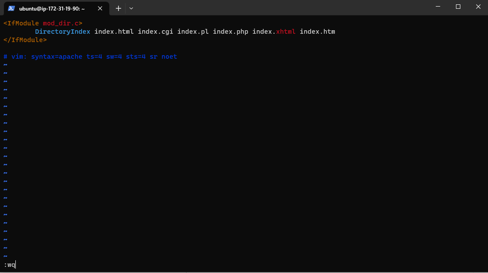

2. I ran `sudo systemctl reload apache2` after saving and closing the file, and reloaded Apache so the changes takes effect and below is the output.
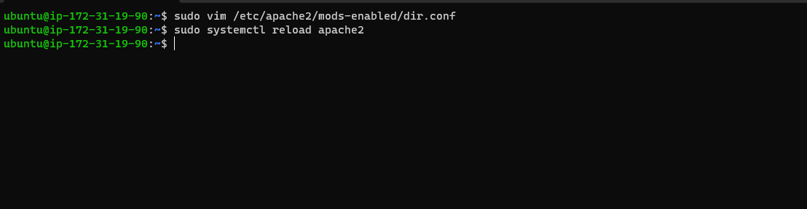

Now that this is done i would create a new PHP script to test that PHP is correctly installed and configured on the server.
3. I created a new file named index.php inside my custom web root folder by running `vim /var/www/projectlamp/index.php` and pasting my text which gave the outputs below respectively.
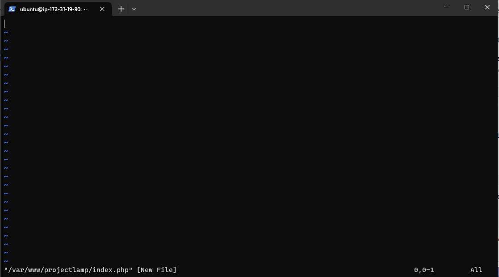
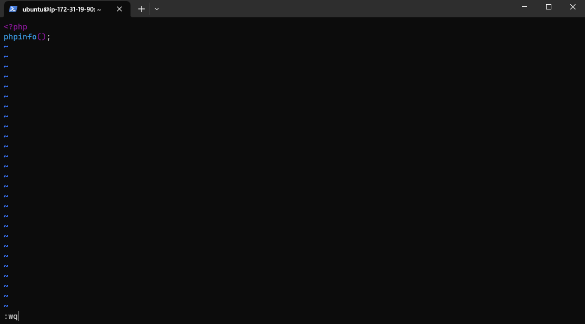
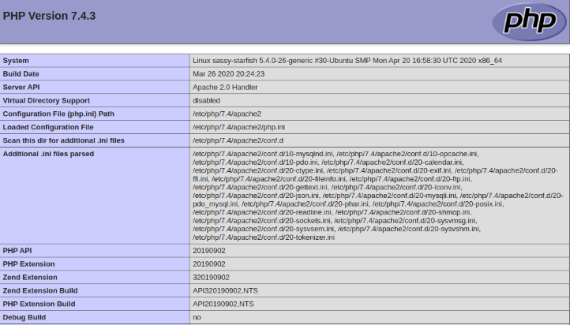

THANK YOU!